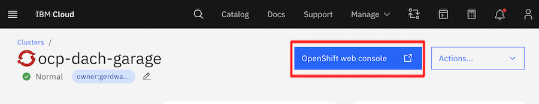
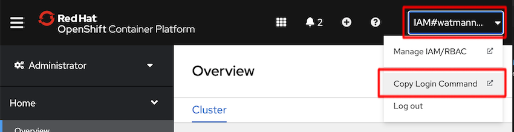

# Lab 2: IBM Cloud + OpenShift connectivity check

## Prerequisites

This set of instructions requires that you have

- Access to an existing IBM Cloud Account
- Access permissions for an Openshift cluster (Kubernetes Service)
- Locally installed OpenShift CLI

## Login to IBM Cloud via UI

The easiest way to configure access to an existing OpenShift cluster on IBM Cloud is to follow the instructions in the IBM Cloud UI. Login via the browser **https://cloud.ibm.com** , make sure you have selected the correct IBM Cloud account and navigate to **Navigation (aka Burger) Menu -> OpenShift -> Clusters** . Select the bootcamp cluster provided to you and navigate to the **Overview** tab in the OpenShift cluster view. From there select the **OpenShift web console**.



Within the OpenShift web console select your profile (prefixed by IAM#), then navigate to Copy Login Command.
This allows you to copy/paste a login command you can use with your OC CLI.



## Connect to OpenShift cluster with OC CLI

Just copy and paste the login command (token based) into bash.
```bash
$ oc login --token=yourtoken --server=yourserver

Logged into "https://cxyz.eu-de.containers.cloud.ibm.com:30123" as "IAM#watmann@de.ibm.com" using the token provided.
You have access to 74 projects, the list has been suppressed. You can list all projects with ' projects'
Using project "default".
```

Try to execute `oc get nodes` to access details about the Kubernetes Worker Nodes you have access to.

```bash
$ oc get nodes
NAME             STATUS   ROLES           AGE   VERSION
10.134.237.197   Ready    master,worker   52d   v1.19.0+e49167a
10.134.237.201   Ready    master,worker   52d   v1.19.0+e49167a
10.134.237.236   Ready    master,worker   52d   v1.19.0+e49167a
```

**Very good - now you can execute oc commands against your OpenShift cluster**
