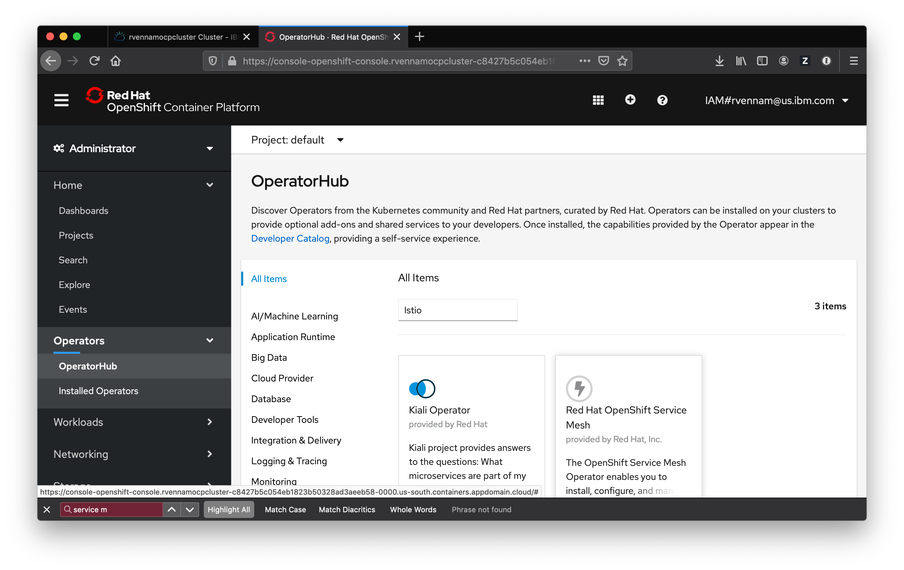
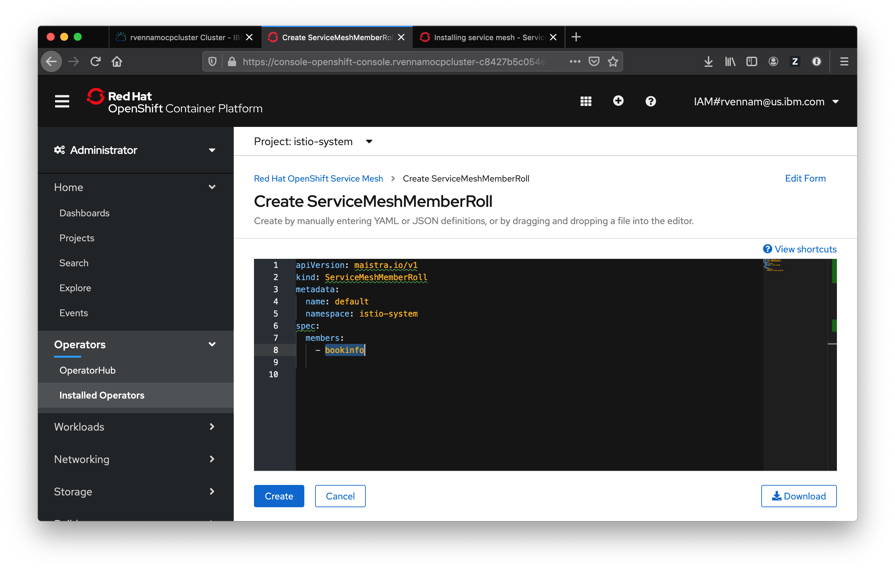

# Lab 10 (Setup): Installing Istio on Red Hat OpenShift on IBM Cloud (we will do this together **once**)

## Install the Operator

1. Navigate to your cluster in the [IBM Cloud Dashboard](https://cloud.ibm.com/kubernetes/clusters)

1. Click on your cluster and Launch **OpenShift web console**

1. Select **Administrator** in the drop down and then select **Operators** -> **OperatorHub**

1. Install the following operators, in order:

- Elasticsearch Operator
- Jaeger Operator
- Kiali Operator
- Red Hat OpenShift Service Mesh Operator

5. Click on **Installed Operators** and refresh the page to see the changes.

   _Click [here](https://docs.openshift.com/container-platform/4.6/service_mesh/v1x/installing-ossm.html) for more details about installing istio on Openshift 4.6_

## Deploying the Red Hat OpenShift Service Mesh control plane

The operator uses a `ServiceMeshControlPlane` resource to determine how to install Istio and what components you want. Let's create that resource now.

1.  Create a new project by going to **Home** -> **Projects** -> **Create Project**
2.  Enter `istio-system` in the **Name** and click **Create**
3.  Navigate to **Operators** -> **Installed Operators**
4.  Click the **Red Hat OpenShift Service Mesh Operator**.
5.  Under **Istio Service Mesh Control Plane** click **Create Instance**.
6.  Then, click **Create**. The Operator creates Pods, services, and Service Mesh control plane components based on your configuration parameters.

### Create a ServiceMeshMemberRoll

ServiceMeshMemberRoll resource is used to to specify the namespaces associated with the Service Mesh.

1. Navigate to **Operators** → **Installed Operators** again.
2. Click the **Red Hat OpenShift Service Mesh Operator**.
3. Under **Istio Service Mesh Member Roll** click **Create Instance**
4. Change `your-project` to `bookinfo` and delete the last line.
5. Then, click **Create**.

Congratulations! You successfully installed Istio into your cluster and configured the `bookinfo` project to use it.
