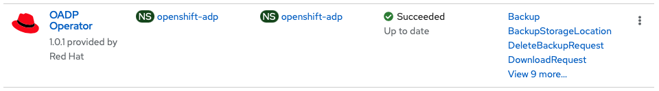
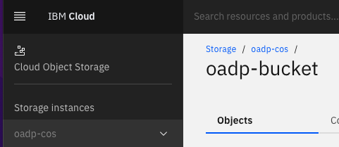
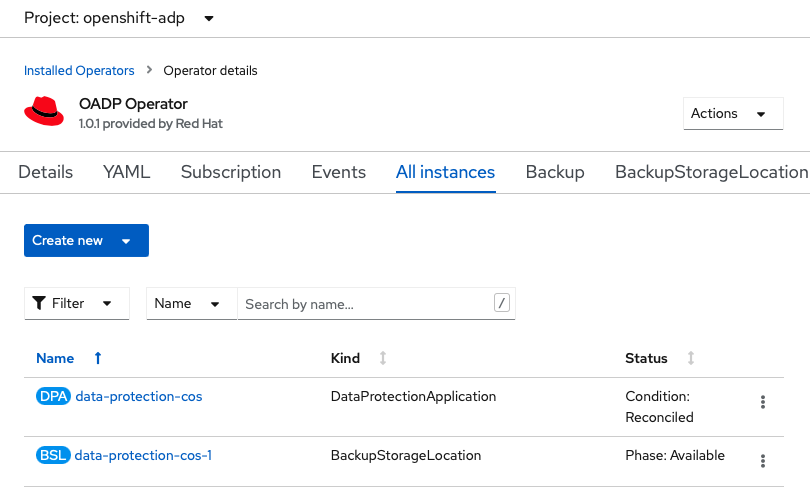
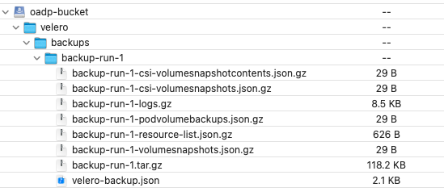
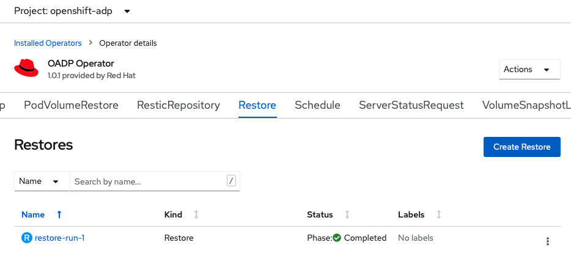
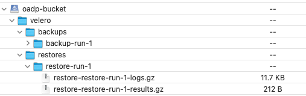

# OpenShift API for Data Protection (OADP)

## Overview
An important part of any platform used to host business and user workloads is data protection. Data protection may include operations including on-demand backup, scheduled backup and restore. These operations allow the objects within a cluster to be backed up to a storage provider, either locally or on a public cloud, and restore that cluster from the backup in the event of a failure or scheduled maintenance.

Red Hat has created OpenShift API for Data Protection, or OADP, for this purpose. OADP brings an API to the OpenShift Container Platform that Red Hat partners can leverage in creating a disaster recovery and data protection solution.

OADP (OpenShift APIs for Data Protection) is realized through an operator that Red Hat has created to create backup and restore APIs in the OpenShift cluster. The OADP Operator upstream project can be found here: https://github.com/openshift/oadp-operator . 
Red Hat has not added, removed or modified any of the APIs as documented in the Velero upstream project used as underlying fundament.

OADP provides the following APIs:
- Backup
- Restore
- Schedule
- BackupStorageLocation
- VolumeSnapshotLocation

The Red Hat OADP operator version 1.0 was released in Feb 2022 and is the first generally available release and fully supported. Earlier versions (pre-1.0) of the operator were available as a community operator with only community support.

OADP is not a full end-to-end data protection solution. It will be up to the storage providers to integrate their own components of the solution to enhance scheduling, policy control and enhanced data movement features.

OADP provides APIs to backup and restore OpenShift cluster resources (yaml files), internal images and persistent volume data.

The OADP 1.0 operator (and later) can be found within the embedded OperatorHub in the OpenShift web console, and fully supported, in versions 4.6 and later.

## How to get started with OADP backup and restore (using IBM COS)

1. Install the OADP Operator provided by Red Hat via the OperatorHub into the Operator recommended Namespace openshift-adp.


2. Create a cross-regional IBM Cloud Object Storage instance and a bucket to serve as Backup Storage Location. Create service credentials with HMAC keys.


3. Create a file named ```credentials-velero``` that contains the HMAC credentials in the following format, *including* the default section

   ```
   [default]
   aws_access_key_id=<REPLACE-WITH-cos_hmac_keys-access_key_id>
   aws_secret_access_key=<REPLACE-WITH-cos_hmac_keys-secret_access_key>
   ```

4. Create a Kubernetes Secret in the openshift-adp project based on the created file using the following command:
   ```
   oc create secret generic cloud-credentials --namespace openshift-adp --from-file cloud=./credentials-velero
   ```

5. Create an initial Data Protection Application leveraging the created IBM COS bucket as Backup Storage Location.
   ```
   apiVersion: oadp.openshift.io/v1alpha1
   kind: DataProtectionApplication
   metadata:
     name: data-protection-cos
     namespace: openshift-adp
   spec:
     backupLocations:
       - velero:
           provider: aws
           default: true
           objectStorage:
             bucket: oadp-bucket
             prefix: velero
           config:
             profile: "default"
             region: eu-geo
             s3ForcePathStyle: "true"
             s3Url: https://s3.eu.cloud-object-storage.appdomain.cloud
           credential:
             name: cloud-credentials
             key: cloud
     configuration:
       restic:
         enable: true
       velero:
         defaultPlugins:
           - openshift
           - aws
   ```

  
6. The result should be a **reconciled** DataProtectionApplication along with an **available** automatically generated BackupStorageLocation.

      

7. Now lets trigger a backup of an OpenShift project of your choice with the following YAML.

   ```
   apiVersion: velero.io/v1
   kind: Backup
   metadata:
     namespace: openshift-adp
     name: backup-run-1
   spec:
     defaultVolumesToRestic: true
     includedNamespaces:
       - dev-gw
   ```

8. The IBM COS Bucket should contain the backup artifacts along with detailed logs about the execution.
   
      

9. Now lets delete the test project, delete the released persistent volumes and run a restore.

   ```
   apiVersion: velero.io/v1
   kind: Restore
   metadata:
     namespace: openshift-adp
     name: restore-run-1
   spec:
     backupName: backup-run-1
     includedNamespaces:
       - dev-gw
     restorePVs: true
   ```

10. In this test the whole inventory of the test OpenShift project was restored successfully.
      

11. You should validate the details in the restore logs.
      