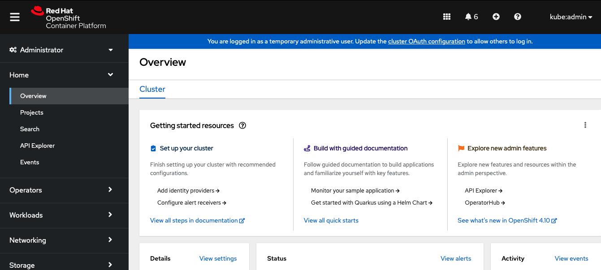

# Red Hat OpenShift IPI on IBM Cloud (self-managed Development Sandbox) - Work in Progress

## Prereqs
- You have an IBM Cloud account with a subscription. You cannot install OpenShift Container Platform on a free or trial IBM Cloud account.
- You have a Red Hat account that allows you to retrieve the needed pull secret for the OpenShift installation from `https://console.redhat.com/openshift/install/ibm-cloud`
- You are logged into a Jumpbox / Bastion VSI in a VPC mgmt subnet on IBM Cloud
- You have downloaded the OpenShift installer and the OpenShift command-line tools onto your Jumpbox / Bastion VSI
- You have a Domain registered with a provider of your choice and associated it to CIS. For simplicity all IBM Cloud services are located in the same resource group.

## Create the IBM Cloud Internet Services Instance
## Create a VPC + RHEL Jumpbox / Bastion VSI (RHEL)
## Create the required IBM IAM access policies

In addition to the documented IAM policies we need:
- Admin on resource group (to be able to assign viewer policy)
- Admin on Internet Services in account

## Configure IAM for IBM Cloud
### Obtain the ccoctl binary
```bash
$ RELEASE_IMAGE=$(./openshift-install version | awk '/release image/ {print $3}')

$ CCO_IMAGE=$(oc adm release info --image-for='cloud-credential-operator' $RELEASE_IMAGE)

$ oc image extract $CCO_IMAGE --file="/usr/bin/ccoctl" -a <pull-secret-file-name>

$ chmod 775 ccoctl

$ ccoctl --help
```

## Create the OpenShift configuration files
### Create an initial install-config.yaml

```bash
$ ./openshift-install create install-config --dir ipi_040422_1700
```
- Choose `ibmcloud` as hyperscaler
- Use e.g. `eu-de (EU Germany)`
- Choose your prepared domain, its extracted from CIS
- Define a cluster name
- Copy/paste your pull secret

```yaml
apiVersion: v1
baseDomain: <yourdomain>
compute:
- architecture: amd64
  hyperthreading: Enabled
  name: worker
  platform: {}
  replicas: 3
controlPlane:
  architecture: amd64
  hyperthreading: Enabled
  name: master
  platform: {}
  replicas: 3
metadata:
  creationTimestamp: null
  name: <your-cluster-name>
networking:
  clusterNetwork:
  - cidr: 10.128.0.0/14
    hostPrefix: 23
  machineNetwork:
  - cidr: 10.0.0.0/16
  networkType: OpenShiftSDN
  serviceNetwork:
  - 172.30.0.0/16
platform:
  ibmcloud:
    region: eu-de
publish: External
pullSecret: '{...}'
```

### Extend the initial install-config.yaml

Add the
- Resource Group name
- Manual credential mode
- SSH key
and save the file in a backup folder for later re-use.

```yaml
apiVersion: v1
baseDomain: <yourdomain>
compute:
- architecture: amd64
  hyperthreading: Enabled
  name: worker
  platform: {}
  replicas: 3
controlPlane:
  architecture: amd64
  hyperthreading: Enabled
  name: master
  platform: {}
  replicas: 3
metadata:
  creationTimestamp: null
  name: <your-cluster-name>
networking:
  clusterNetwork:
  - cidr: 10.128.0.0/14
    hostPrefix: 23
  machineNetwork:
  - cidr: 10.0.0.0/16
  networkType: OpenShiftSDN
  serviceNetwork:
  - 172.30.0.0/16
platform:
  ibmcloud:
    region: eu-de
    resourceGroupNames: <your-resource-group>
credentialsMode: Manual
sshKey: <your ssh-key>
publish: External
pullSecret: '{...}'
```
### Fulfill the pre-reqs for the Cloud Credential Operator (CCO) to operate in manual mode

These activities create a set of IBM Cloud Service IDs the installer will leverage.

```bash
$ ./openshift-install create manifests --dir /opt/ipi_040422_1700

$ RELEASE_IMAGE=$(./openshift-install version | awk '/release image/ {print $3}')

$ oc adm release extract --cloud=ibmcloud --credentials-requests $RELEASE_IMAGE --to=/opt/ipi_040422_1700/credential_requests

$ ccoctl ibmcloud create-service-id --credentials-requests-dir /opt/ipi_040422_1700/credential_requests --name <your-cluster-name> --output-dir /opt/ipi_040422_1700 --resource-group-name <your-resource-group>
```

## Execute the OpenShift Cluster Installation
```bash
$ ./openshift-install create cluster --dir /opt/ipi_040422_1700  --log-level=debug 
```
If everything worked out successful you should see the following result of cluster creation.

```bash
DEBUG Cluster is initialized                       
INFO Waiting up to 10m0s (until 3:52PM) for the openshift-console route to be created... 
DEBUG Route found in openshift-console namespace: console 
DEBUG OpenShift console route is admitted          
INFO Install complete!                            
INFO To access the cluster as the system:admin user when using 'oc', run 'export KUBECONFIG=/opt/ipi_040422_1700/auth/kubeconfig' 
INFO Access the OpenShift web-console here: https://console-openshift-console.apps.<your-cluster-name>.<your-domain> 
INFO Login to the console with user: "kubeadmin", and password: "" 
DEBUG Time elapsed per stage:                      
DEBUG            network: 8m42s                    
DEBUG          bootstrap: 6m49s                    
DEBUG             master: 13m20s                   
DEBUG Bootstrap Complete: 3m7s                     
DEBUG                API: 1m55s                    
DEBUG  Bootstrap Destroy: 4m44s                    
DEBUG  Cluster Operators: 7m25s                    
INFO Time elapsed: 44m22s                         
$  
```

## Validate the OpenShift Cluster Installation
Authentication against the OpenShift web-console with the given kubeadmin credentials.



## Required post-install steps

TBD -- It seems we have to do additional post-installation steps, otherwise I got into the following exception after two days - trying to access the OpenShift Console.

```
{"error":"server_error","error_description":"The authorization server encountered an unexpected condition that prevented it from fulfilling the request.","state":"22137c82"}
```
